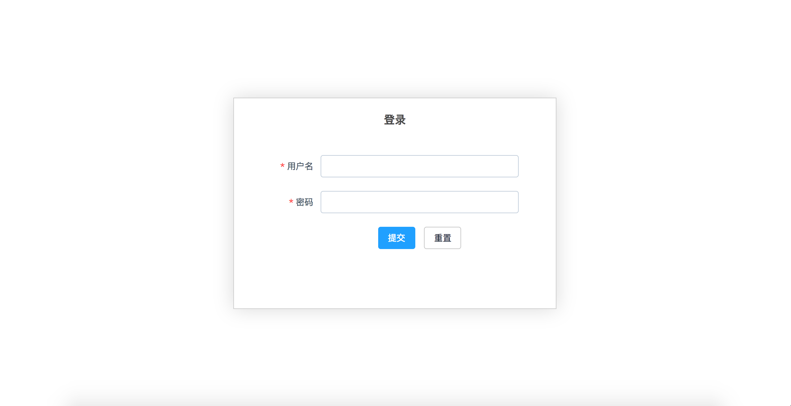
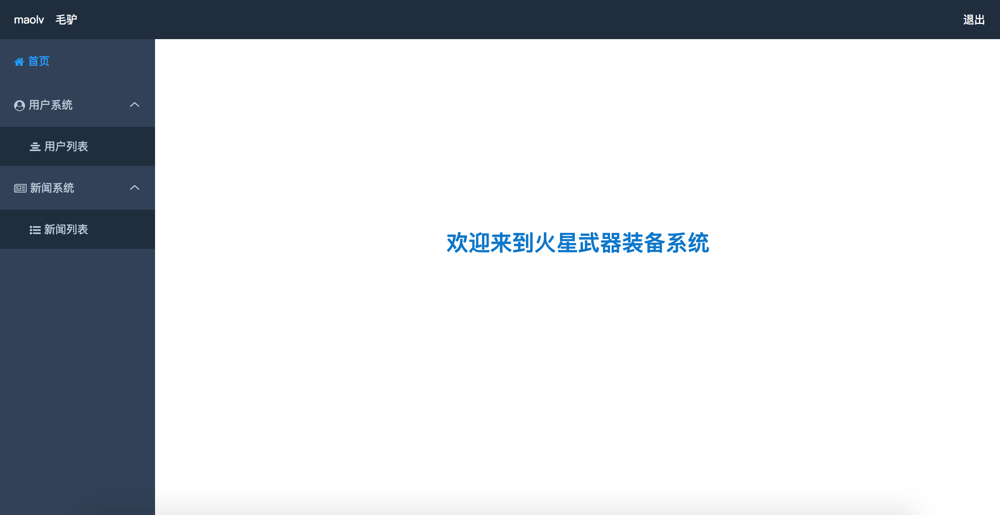
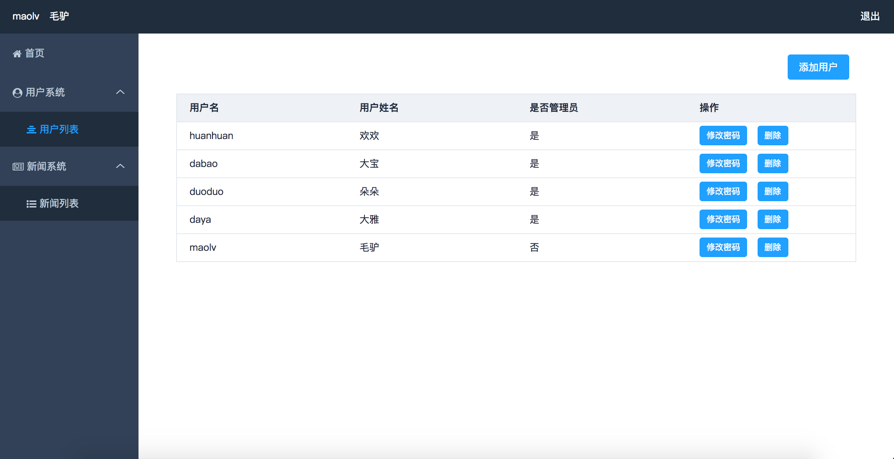
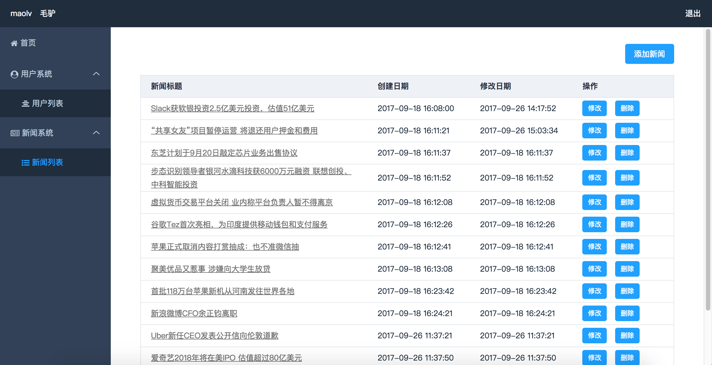

# 功能模块

## 系统使用前后端分离，一个简单的前后端架子，使用技术栈 Vue(前端) + ElementUI + Egg（后端）+ NunJunck（后端模板） + Mongodb（数据库）+ Mongoose

### web端

    前端文件 food_web 目录

    1、登录

    2、用户管理 - 添加用户、删除用户、修改密码

    3、新闻中心 - 新闻列表、新闻详情

        新闻分成两种方法实现

        1）前后分离，列表和详情都走的接口，详情通过id来获取库中的详情内容

        2）后端模板，列表和详情走的后端模板，这里注意前端因为使用的Vue所以在写跳转时只能

### 后台管理

    后端文件 food_node

    1、登录（管理后台）

    2、用户管理: 查询、添加、删除

    3、新闻管理: 查询、添加、删除、修改

### 数据库

    后端文件 db 目录

    在mongodb中创建 food_node_database 库将db目录的Collection导入

### DEMO

    1、登录

    2、首页

    3、用户管理

    4、新闻管理

